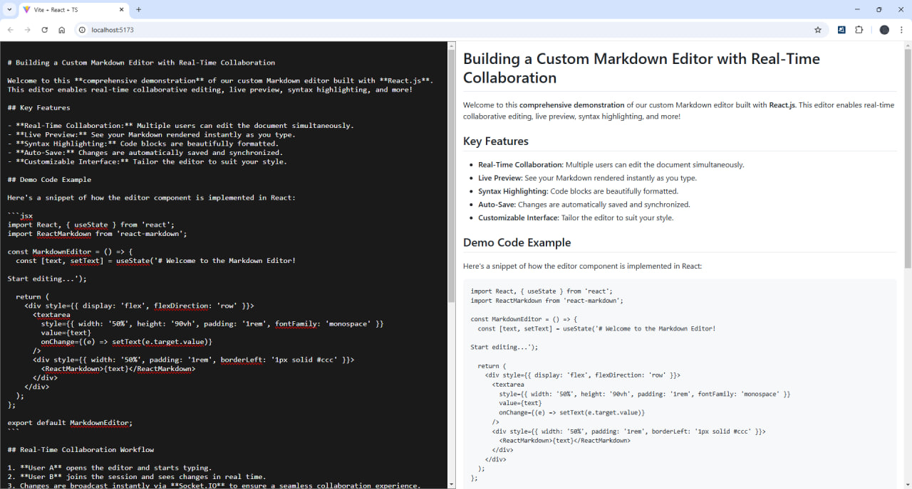

# Custom Editor React

Welcome to the **Custom Editor React** project! This is a front-end implementation of a real-time collaborative text editor built with **React.js**. It integrates seamlessly with a backend powered by **Node.js, Express, and Socket.IO** to provide a live editing experience.

> Back-End repository: https://github.com/BaseMax/editor-realtime-collaborative



## Features

- **Real-Time Collaboration:** Multiple users can edit the same document simultaneously.
- **Live Markdown Preview:** Users can see rendered Markdown in real time.
- **WebSocket Integration:** Ensures instant synchronization between users.
- **User Tracking:** Displays the number of online users.
- **Customizable Interface:** Can be extended with themes, plugins, and additional features.
- **React-Based Architecture:** Ensures a modern and scalable front-end.

## Technologies Used

- **React.js** - Front-end library for building UI components.
- **TypeScript** - Ensures type safety and better development experience.
- **Socket.IO** - Enables real-time communication with the backend.

## Getting Started

### Prerequisites

Ensure you have the following installed:

- [Node.js](https://nodejs.org/) (v16 or later)
- [npm](https://www.npmjs.com/) or [yarn](https://yarnpkg.com/)

### Installation

1. Clone the repository:
   ```sh
   git clone https://github.com/BaseMax/custom-editor-react.git
   cd custom-editor-react
   ```

2. Install dependencies:
   ```sh
   npm install  # or yarn install
   ```

3. Start the development server:
   ```sh
   npm run dev  # or yarn dev
   ```

   The development server will start on **http://localhost:3000**.

### Project Structure

```
02/17/2025  04:02 PM               253 .gitignore
02/17/2025  06:10 PM           105,941 bun.lock
02/17/2025  04:02 PM               734 eslint.config.js
02/17/2025  04:05 PM               225 eslintrc.json
02/17/2025  04:02 PM               366 index.html
02/17/2025  03:58 PM             1,086 LICENSE
02/17/2025  04:45 PM    <DIR>          node_modules
02/17/2025  04:45 PM           127,528 package-lock.json
02/17/2025  06:10 PM               948 package.json
02/17/2025  04:02 PM    <DIR>          public
02/17/2025  04:02 PM             1,607 README.md
02/17/2025  05:30 PM    <DIR>          src
02/17/2025  04:02 PM               665 tsconfig.app.json
02/17/2025  04:02 PM               119 tsconfig.json
02/17/2025  04:02 PM               593 tsconfig.node.json
02/17/2025  04:02 PM               161 vite.config.ts
```

## WebSocket Events

| Event Name       | Description |
|-----------------|-------------|
| `connection`    | Triggered when a user connects. |
| `updateContent` | Sends the latest content to clients. |
| `contentChange` | Updates content from a user. |
| `onlineUsers`   | Notifies users of the current online count. |
| `disconnect`    | Triggered when a user disconnects. |

## Contributing

Contributions are welcome! Feel free to:

- Submit issues.
- Open pull requests.
- Suggest new features.

## License

This project is licensed under the **MIT License**.

## Author

**Seyyed Ali Mohammadiyeh (Max Base)**  

GitHub: [@basemax](https://github.com/BaseMax)  

Email: maxbasecode@gmail.com

Happy Coding! 🚀
